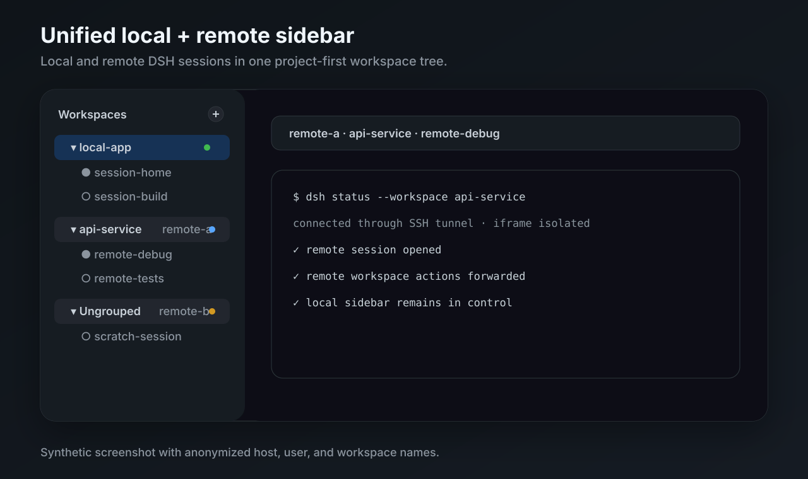
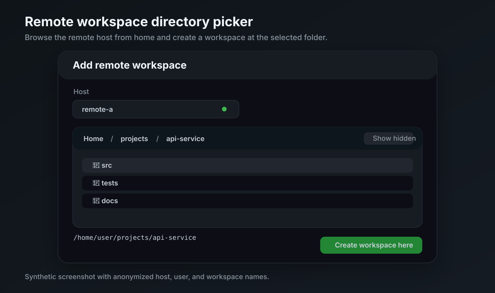
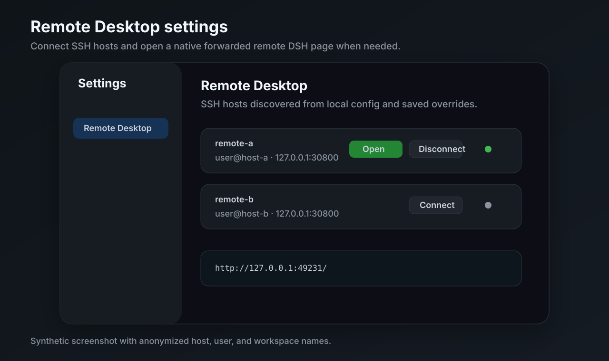

# dsh-remote-desktop

Operate remote DeepSeek Harness web sessions from one local DSH web page.

`dsh-remote-desktop` is a two-plugin bundle:

- `dsh-remote-desktop` runs in the local DSH web profile. It discovers SSH hosts, opens tunnels, proxies remote DSH APIs, and replaces the local workspace sidebar with a unified local/remote workspace browser.
- `dsh-remote-desktop-companion` runs in each remote DSH web profile. It validates iframe control messages from the local page, opens requested remote sessions, and hides the embedded remote sidebar.

The result is a project-first sidebar where local workspaces and connected remote workspaces appear in one list. Remote projects show a compact host marker such as `win-wsl` or `xsn`, and remote sessions open inside an isolated iframe.

## Features

- Unified local + remote workspace sidebar for DSH Web.
- SSH-based host discovery from concrete `Host` entries in `~/.ssh/config`.
- Per-host loopback tunnel and browser proxy.
- Remote session open, new session, rename, fork, archive, search, and workspace mutations routed to the owning host.
- Add remote workspace flow with a remote directory picker starting at the SSH user's home.
- Source-aware Ungrouped buckets, including per-host `Archive all sessions`.
- Official Settings integration for Remote Desktop host management.

## Feature screenshots

All screenshots below are synthetic and use anonymized host, user, workspace, and session names.

### Unified local + remote sidebar



### Remote workspace directory picker



### Remote Desktop settings



## Install

Install the local controller into the local DSH web profile:

```sh
dsh plugin --profile web add dsh-remote-desktop
```

Install the companion into every remote DSH web profile that should be controlled from the local page:

```sh
dsh plugin --profile web add dsh-remote-desktop-companion
```

Before npm publication, clone this repository and install the package directories explicitly:

```sh
git clone https://github.com/sincerity711/dsh-remote-desktop.git

dsh plugin --profile web add /path/to/dsh-remote-desktop/packages/local
# On each remote host/profile:
dsh plugin --profile web add /path/to/dsh-remote-desktop/packages/companion
```

From a DeepSeek Harness source checkout, replace `dsh` with the checkout wrapper, for example `pnpm dsh`.

## Remote host setup

1. Start DSH Web on the remote machine, bound to remote loopback.
2. Install `dsh-remote-desktop-companion` in that remote web profile.
3. Add a concrete SSH `Host` alias on the local machine.
4. Open local DSH Web, go to Settings → Remote Desktop, and connect the host.

Minimal remote command:

```sh
DSH_HOME=$HOME/.dsh-remote-desktop \
  dsh --profile web \
  --host 127.0.0.1 \
  --port 30800 \
  --trusted-host 127.0.0.1:30800
```

Minimal local SSH config:

```sshconfig
Host win-wsl
  HostName win-wsl
  User your-user
```

See [Remote server setup](docs/remote-server-setup.md) for the full setup checklist.

## Architecture reference

- [Architecture](docs/architecture.md) — package roles, SSH/proxy lifecycle, remote APIs, iframe bridge, sidebar projection, Add workspace flow, and fork inventory.
- [Acceptance standard](docs/acceptance.md) — P0/P1/P2 validation scope and isolated test-home rules.

## Community plugin discovery

This repository is prepared for the current DeepSeek Harness community plugin discovery flow. Add these GitHub topics to the public repository:

```text
dsh-plugin
deepseek-harness
dsh
remote-desktop
remote-workspace
```

The publishable packages also carry matching npm `keywords`.

## Development

```sh
npm run check
```

Acceptance commands require the documented remote host prerequisites:

```sh
npm run acceptance:p0
npm run acceptance:p1
```
