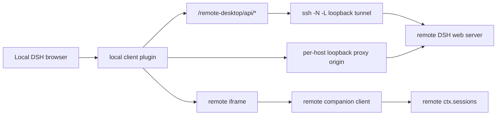
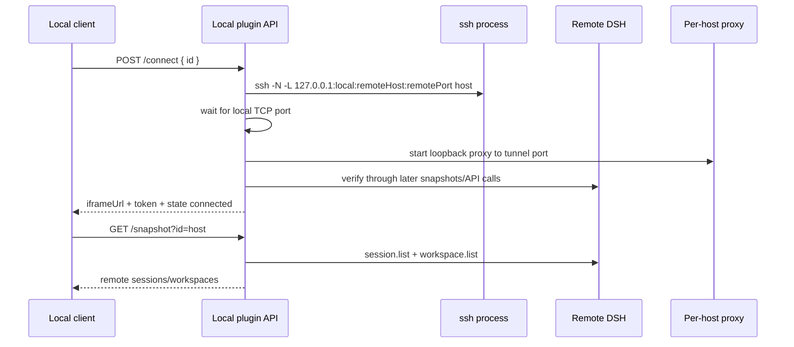

# dsh-remote-desktop architecture

`dsh-remote-desktop` lets one local DSH web page operate sessions from other DSH web instances. It is intentionally a two-plugin system: the local plugin owns host discovery, SSH/proxy lifecycle, and the unified local/remote UI; the companion plugin runs in each remote DSH profile and validates iframe control messages from the local page.

## Package roles

| Package | Installed on | Main files | Role |
| --- | --- | --- | --- |
| `dsh-remote-desktop` | Local DSH web profile | `packages/local/lib/index.js`, `packages/local/lib/client.js` | Discovers SSH hosts, opens tunnels, proxies remote DSH APIs, snapshots remote workspaces/sessions, replaces selected local UI surfaces, and renders remote iframes. |
| `dsh-remote-desktop-companion` | Remote DSH web profile | `packages/companion/lib/index.js`, `packages/companion/lib/client.js` | Runs only inside `?dshRemoteDesktop=1` iframe mode, hides the embedded remote sidebar, validates parent origin/token, and opens requested remote sessions. |

The local bundle patch disables stock `ui-workspace`, keeps the official `ui-settings-general` shell enabled, then inserts `dsh-remote-desktop`. The companion bundle only inserts `dsh-remote-desktop-companion`.

## Runtime overview



A connected host has three local runtime resources:

1. an SSH process forwarding a free local loopback port to `remoteDshHost:remoteDshPort` on the remote machine;
2. a per-host local proxy server on another free loopback port;
3. a source token embedded only in the iframe URL hash.

The source token identifies the iframe control channel. It is not used for native remote pages opened from Settings.

## Local server plugin

`packages/local/lib/index.js` is the server-side Cordis plugin. It injects `webServer` and registers the `/remote-desktop/api` prefix.

### Host state

Host definitions come from two places:

- concrete `Host` aliases in `~/.ssh/config`, excluding wildcard aliases containing `*` or `?`;
- saved source overrides in `sources.json` under `DSH_REMOTE_DESKTOP_HOME`, or under `DSH_HOME/remote-desktop` when `DSH_HOME` is set.

Saved entries override discovered SSH entries with the same id. Connections prefer `ssh <alias>` when `sshAlias` is present, so OpenSSH still owns `HostName`, `User`, `Port`, `IdentityFile`, `ProxyJump`, and related options.

### API routes

| Route | Purpose |
| --- | --- |
| `GET /remote-desktop/api/sources` | Return discovered/saved hosts plus runtime state, errors, iframe URL, and token when connected. |
| `GET /remote-desktop/api/hosts` | Alias-style host listing with the same public fields. |
| `POST /remote-desktop/api/sources` | Save or override one host definition. |
| `POST /remote-desktop/api/connect` | Start the SSH tunnel, create the proxy origin, and return connected state. |
| `POST /remote-desktop/api/disconnect` | Kill the SSH process and close the proxy for one host. |
| `POST /remote-desktop/api/delete` | Disconnect and remove a saved host override. Discovered SSH hosts remain discoverable. |
| `GET /remote-desktop/api/snapshot?id=<host>` | Fetch remote `session.list` and `workspace.list` through the tunnel. |
| `GET /remote-desktop/api/browse?id=<host>&path=<path>&hidden=0|1` | List readable remote directories for the Add remote workspace picker, starting at the SSH user's home when `path` is omitted. |
| `*/remote-desktop/api/host-api?id=<host>&path=/api/<method>` | Proxy one host API request to the connected remote DSH instance. |

### Connection lifecycle



Disconnect and cleanup kill the SSH process, close the proxy server, and remove active remote UI state for that host.

## Local client plugin

`packages/local/lib/client.js` is a hand-bundled web client. It maintains an in-memory remote store containing sources, remote snapshots, active target, pending iframe open requests, companion readiness, and the remote workspace setup modal state.

The client runs in two modes.

| Mode | Detection | Enabled behavior |
| --- | --- | --- |
| Main-host mode | no `?dshRemoteDesktop=1` query marker | unified sidebar, remote iframe overlay, Settings replacement shell, Remote Desktop settings section, remote source service, host refresh and snapshots, parent side of the iframe bridge. |
| Remote-iframe mode | `?dshRemoteDesktop=1` | only the Add workspace splitter and a directory-flow anchor. Sidebar, settings shell, source management, and overlay are disabled inside the iframe. |

Main-host mode exposes a small `remoteDesktop` service when `ctx.provide` exists, or falls back to `window.__dshRemoteDesktop`. The service provides source listing, subscription, active target, and open-local/open-remote commands.

## Sidebar and workspace projection

The local sidebar presents a project-first tree. Local workspaces and connected remote workspaces appear in one list; remote workspace rows carry a compact host marker rather than being grouped under host headings.

Remote ids are source-qualified before entering the official workspace browser logic:

```text
remote::<sourceId>::<rawWorkspaceOrSessionId>
```

This prevents collisions between local ids and remote ids, and between different hosts. When a row is clicked, the wrapper decodes the id:

- local session rows call local `ctx.sessions.open` and set active target to local;
- remote session rows set active target to `{ kind: "remote", sourceId, sessionId }` and queue an iframe `open-session` command;
- local workspace mutation actions still call local workspace/session APIs;
- supported remote workspace/session mutations forward to the owning host through `/remote-desktop/api/host-api`;
- cross-source drag and reorder attempts are rejected before a local or unrelated remote API receives a source-qualified id.

Ungrouped sessions are also source-aware. Local loose sessions render under the local Ungrouped bucket, and each connected remote host with loose sessions renders its own Ungrouped bucket with the same compact host marker used by remote workspace rows. Each Ungrouped bucket exposes `Archive all sessions`, which archives only that bucket's sessions through the local archive API or that host's remote `workspace.archiveSession` API.

## Remote iframe overlay and bridge

The remote overlay is portalled under `document.body` and positioned fixed from the right edge of the local sidebar to the viewport edge. It keeps one iframe per connected source and shows only the active remote source.

The parent-to-child open-session protocol is:

```text
parent -> child: dsh-remote-desktop/open-session { token, sessionId }
child  -> parent: dsh-remote-desktop/opened { sourceToken, sessionId }
child  -> parent: dsh-remote-desktop/open-failed { sourceToken, sessionId, error }
child  -> parent: dsh-remote-desktop/ready { sourceToken }
```

The companion accepts an open-session request only when both the message origin and token match the iframe URL state. The parent maps readiness messages by source token. The iframe URL also carries the parent origin in its hash so the companion can reply to the exact opener origin.

## Companion plugin

`packages/companion/lib/client.js` applies only when the remote page has `?dshRemoteDesktop=1`, a non-empty `token`, and a non-empty `parent` hash parameter.

It performs three tasks:

1. installs scoped CSS that hides the remote app's own left sidebar while keeping the remote main area and remote plugins mounted;
2. posts periodic `ready` messages to the validated parent origin;
3. listens for validated `open-session` messages and repeatedly calls `ctx.sessions.open(sessionId)` until the requested session becomes current or times out.

The server entry point `packages/companion/lib/index.js` is intentionally empty because the companion behavior is browser-side only.

## Workspace add flow

The client owns `WorkspaceAddSplitter`, registered into `conversation.hero.workspace` in both main-host and remote-iframe modes. The official-looking sidebar Add workspace button opens this splitter directly instead of first opening the official single-instance workspace picker or directory flow. Picker footer Add workspace entries route to the same splitter.

- Local branch: delegates to the official directory-flow slot for the current DSH instance, then creates a workspace through that instance's `ctx.workspaces.create`.
- Main-host remote branch: opens a local Remote setup modal, browses remote directories through `/remote-desktop/api/browse`, posts `workspace.create` through `/remote-desktop/api/host-api` for the selected directory, refreshes the host snapshot, creates or reuses a blank remote session, and opens the remote iframe.
- Remote-iframe remote branch: sends `dsh-remote-desktop/add-workspace-remote-request` to the parent with the child token and request id. The parent validates origin/token and opens the main-host Remote setup modal.

Remote workspace creation must not fall back to local workspace creation after remote errors.

## Settings flow

The local bundle keeps the official `ui-settings-general` shell. Remote Desktop extends it through the official `settings.section` slot with a `Remote Desktop` page that lists SSH hosts, shows connection state, and exposes Connect, Disconnect, and Open native DSH actions.

The native remote Settings URL is derived from the iframe URL by removing `?dshRemoteDesktop=1` and the token hash. Remote Settings are not embedded in the local modal and do not receive the iframe token.

## Fork and replacement inventory

This project uses “fork” narrowly: copied upstream source with a recorded baseline that must be rebased when upstream changes.

| Surface | Status | Upstream baseline | Why |
| --- | --- | --- | --- |
| `ui-workspace` browser/picker/tree/rows/store/locales | **Vendored fork** | `deepseek-harness` commit `9f8359451a6f8df17f65bc2c398810ac19bdfc8a`, package `packages/client/ui-workspace`; recorded in `packages/local/upstream/ui-workspace/UPSTREAM.md` | The sidebar must look and behave like official DSH while accepting source-qualified remote rows, host markers, remote open routing, and host-forwarded remote workspace/session actions. |
| Remote Desktop settings section | **Official-slot extension, not a fork** | `settings.section` from `ui-settings-general` | The official Settings shell stays enabled; Remote Desktop contributes one settings page using official primitives and design tokens. |
| Workspace Add splitter | **Plugin-owned replacement/extension, not a source fork** | Uses official directory-flow slot and UI primitives | The first screen must split Local and Remote. Local delegates back to the official current-instance directory flow; Remote is plugin-owned. |
| Local server API, SSH tunnel/proxy, remote store, iframe overlay, companion bridge | **Custom dsh-remote-desktop code** | None | These implement remote host lifecycle and iframe control; they are not forks of DSH packages. |
| Companion sidebar-hiding CSS | **Custom compatibility shim** | None | It adapts the embedded remote app frame in iframe mode and must remain narrowly scoped. |

The only true source fork today is the `ui-workspace` fork. Settings is an official-slot extension. Add workspace is an intentional plugin-owned replacement/extension, but it does not carry a copied upstream source baseline.

## Maintenance rules

- Rebase the `ui-workspace` fork with the procedure in `packages/local/upstream/ui-workspace/UPSTREAM.md` whenever the upstream workspace browser changes.
- Keep `packages/local/upstream/ui-workspace/remote-desktop.patch` updated with the maintained delta until the client is split into source modules.
- When touching iframe layout, sidebar behavior, Settings, or Add workspace, run `npm run check` and use the manual checklist in `scripts/acceptance/check-ui-manual.md` when visual behavior changes.
- Preserve origin and token validation for every parent/child iframe message.
- Do not expose the iframe source token in native remote Settings URLs.
