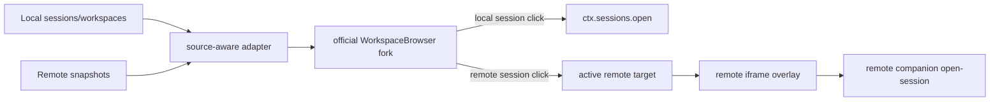

# Official Workspace Sidebar Fork Design

## Goal

Replace the current hand-written `dsh-remote-desktop` workspace/sidebar UI with a rebaseable fork of the official `@deepseek-ai/dsh-client-ui-workspace` sidebar. The fork must preserve the official workspace browser appearance and interaction model. The only visible remote-specific addition is a small host marker next to remote workspace/project rows.

Settings are already handled outside this work. Add workspace keeps the existing Local / Remote splitter; this design only changes the workspace/session browser in the left sidebar.

## Official baseline

The fork baseline is the official workspace UI from:

```text
repo: /Users/i060912/SAPDevelop/deepseek-harness
commit: 9f8359451a6f8df17f65bc2c398810ac19bdfc8a
package: packages/client/ui-workspace
```

Copied official files are limited to the sidebar browser and its direct helpers:

```text
src/client/WorkspaceBrowser.tsx
src/client/WorkspaceBrowser.module.css
src/client/rows/Rows.tsx
src/client/rows/Rows.module.css
src/client/tree.ts
src/client/stores.ts
src/client/locales.ts
src/client/WorkspacePicker.tsx              # copied so the Add workspace entry can keep official chrome
src/client/contract/slots.ts                # copied as the local fork contract reference
```

The implementation may use JavaScript-transpiled copies because `dsh-remote-desktop` currently ships `lib/` JavaScript directly, but the copied files must keep clear upstream provenance comments and stay structurally close to the official source.

## Non-goals

- Do not redesign Settings.
- Do not remove the existing Add workspace Local / Remote splitter.
- Do not keep the current custom `RemoteWorkspaceBrowser` visual design.
- Do not add remote host labels to every session row.
- Do not add a new `Remote Desktop` header, custom search box, or separate remote grouping chrome.
- Do not implement remote rename, delete, reorder, fork, or archive actions in this pass.
- Do not change `deepseek-harness` official UI APIs unless a future design explicitly chooses that route.

## Chosen approach

Use a fork plus patch queue.

`dsh-remote-desktop` stores a copy of the official workspace sidebar files at the pinned hash and records all local changes as a small remote-desktop patch. The intended rebase loop is:

1. Copy fresh official files from a new `deepseek-harness` commit.
2. Reapply the remote-desktop patch.
3. Resolve conflicts only in the patch areas.
4. Run static/unit checks and the manual visual comparison.
5. Update the recorded upstream hash.

This is preferred over a runtime monkey patch because the current official `ui-workspace` package does not expose a stable row-adornment or multi-source data seam. Runtime wrapping would depend on slot internals and would make remote row rendering, disabled actions, and rebase failures harder to reason about.

## Repository layout

Add an upstream record and keep remote logic separate from copied official code:

```text
packages/local/upstream/ui-workspace/
  UPSTREAM.md
  remote-desktop.patch

packages/local/lib/client/upstream-ui-workspace/
  WorkspaceBrowser.js
  WorkspaceBrowser.css
  rows/Rows.js
  rows/Rows.css
  tree.js
  stores.js
  locales.js

packages/local/lib/client/remote-sidebar/
  source-model.js
  local-adapter.js
  remote-adapter.js
  remote-actions.js
```

If the package must remain a single bundled `packages/local/lib/client.js` entry for first implementation, keep these sections as clearly named modules or generated sections in that file. The source separation is still the ownership model: upstream files are copied official UI; remote-sidebar files are `dsh-remote-desktop` owned adapters.

`packages/local/upstream/ui-workspace/UPSTREAM.md` must include:

- official repo path and commit hash;
- copied package and file list;
- local patch file path;
- allowed local change zones;
- exact rebase procedure;
- commands for the checks that protect the fork.

`remote-desktop.patch` must contain the difference between the copied official baseline and the remote-desktop fork. The patch should stay small enough to review during every upstream rebase.

## Data model

The sidebar renders a source-aware view derived from local and remote data, but the row components still receive official-looking group/session facts.

```ts
type SourceKind = 'local' | 'remote'

type ActiveTarget =
  | { kind: 'local'; sessionId?: string }
  | { kind: 'remote'; sourceId: string; sessionId?: string }

interface SourceWorkspaceView {
  sourceId: string
  sourceKind: SourceKind
  sourceLabel: string
  workspaceId: string
  title: string
  path?: string
  sessionIds: string[]
  remoteMarker?: { label: string; state: string }
}

interface SourceSessionView {
  sourceId: string
  sourceKind: SourceKind
  sessionId: string
  title: string
  blank: boolean
  running: boolean
  runningSubagentCount: number
  completed: boolean
  updatedAt: number
  pendingInteraction?: string
}
```

The local adapter maps `ctx.workspaces` and `ctx.sessions` into this model with source id `local`. The remote adapter maps each connected `/remote-desktop/api/snapshot` response into the same model with the remote source id and label. Remote workspace keys must include the source id to avoid collisions with local workspace ids.

The fork should adapt this model back into the official `GroupNode` and `SessionNode` concepts with only the extra remote marker attached to project/workspace groups.

## UI behavior

The wide sidebar uses official `WorkspaceBrowser` layout, spacing, hover states, row heights, selected states, menus, search chrome, icons, and CSS tokens from the pinned baseline.

Remote-specific rendering is limited to remote project rows:

```text
project-name  • win-wsl
```

The marker is compact:

- a small state dot and short host label, or a dot with accessible/hover title when width is tight;
- aligned on the same row as the official project title;
- uses official design tokens for color and text;
- does not change row height;
- does not appear on local workspace rows;
- does not appear on session rows.

Remote workspace row click preserves official project-row behavior: it expands or collapses that group only. It never activates a remote iframe.

Remote session row click sets the active target to `{ kind: 'remote', sourceId, sessionId }`, displays the matching remote iframe, and posts `dsh-remote-desktop/open-session` to the remote companion. Local session row click keeps official `ctx.sessions.open(sessionId)` behavior and hides the remote overlay.

The selected row state compares both source id and session id. A local session and remote session with the same raw session id must not both render selected.

## Local and remote actions

Local workspaces and sessions keep official actions where the existing local APIs support them:

- open;
- start new session in workspace;
- rename workspace;
- delete workspace;
- drag reorder workspace;
- drag reorder session;
- rename session;
- fork session;
- archive session;
- search.

Remote rows are read/open only in this pass:

- remote workspace row can expand/collapse;
- remote session row can open the remote iframe;
- remote start-session is allowed only through the existing remote session/workspace creation flow when explicitly supported by current code;
- remote rename/delete/reorder/fork/archive actions are hidden or disabled;
- search applies title filtering to local and remote visible rows; content-snippet search remains local-only and must be labeled or structured so remote rows are not presented as local content matches.

Disabled remote behavior must not call local mutation APIs with remote ids.

## Add workspace compatibility

The official sidebar Add workspace button should remain visually official. Its action routes into the existing `WorkspaceAddSplitter` instead of directly opening the official single local directory flow.

The splitter keeps current behavior:

- Local uses the official current-instance directory flow and workspace adoption path.
- Remote uses the `dsh-remote-desktop` host/path flow and remote RPCs.
- Inside remote iframes, the splitter still delegates remote creation requests to the main host as today.

The fork should minimize changes around `WorkspacePicker` and directory-flow ownership so future upstream changes to Add workspace are easy to reapply.

## Iframe and active target data flow



The overlay and companion bridge stay owned by `dsh-remote-desktop`; this design does not change iframe isolation, source tokens, or origin validation.

## Rebase discipline

The official fork is treated as vendored UI source. Local edits inside copied official files must be small and named:

- add `remoteMarker` to group/project row data;
- render the project-row marker;
- route `open` through source-aware callbacks;
- guard or hide unsupported remote actions;
- route Add workspace to the splitter.

All broader remote logic belongs outside the copied official files in adapter/action modules. Do not grow new `rd-*` sidebar CSS for official rows. If a style is needed for the marker, keep it in the copied row CSS with a comment naming it as the remote-desktop patch.

The fork should preserve official class names, CSS modules, icon choices, hover behavior, focus behavior, and row geometry wherever possible.

## Static checks

Update `scripts/check-static.mjs` so it proves fork hygiene rather than checking a self-declared marker. Required checks:

- `packages/local/upstream/ui-workspace/UPSTREAM.md` exists and contains the upstream commit hash.
- `packages/local/upstream/ui-workspace/remote-desktop.patch` exists.
- the custom `RemoteWorkspaceBrowser` registration is gone or no longer fills `sidebar.workspaces`.
- legacy sidebar CSS names such as `rd-workspaceHeader`, `rd-sessionRow`, `rd-browser`, and `data-rd-sidebar='official-style-fork'` are absent from the active sidebar implementation.
- the remote marker CSS is the only allowed new sidebar row styling.
- remote overlay and companion token/origin checks remain present.
- Add workspace splitter checks remain present.

## Unit tests

Add or update tests for:

- local-only sidebar renders through the official fork path;
- remote workspace rows render a host marker next to the project title;
- local workspace rows do not render a host marker;
- clicking a remote workspace header toggles expansion without activating the remote iframe;
- clicking a remote session row activates the correct remote source and session;
- clicking a local session row calls local open and clears remote overlay state;
- remote row mutation actions are hidden or disabled and do not call local APIs;
- workspace id collisions across local/remote sources do not corrupt selection or expansion state;
- Add workspace still opens the Local / Remote splitter from the official-looking Add button.

## Manual acceptance

Compare against the official DSH workspace sidebar built from the pinned `deepseek-harness` commit:

- row heights, indentation, hover fill, selected fill, folder/chevron swap, action reveal, typography, and scroll behavior match;
- the only visual difference on remote projects is the compact host marker;
- rail/collapsed sidebar behavior remains official-looking;
- Add workspace still shows the splitter;
- switching local → remote → local works without stuck overlays;
- remote iframe still hides its own sidebar and preserves remote plugin behavior.

## Rollout steps

1. Add upstream record files and copy the official workspace sidebar baseline.
2. Extract source-aware local/remote adapters from the current hand-written sidebar.
3. Apply the minimal official-fork patch for remote markers, source-aware open, unsupported remote action guards, and Add workspace splitter routing.
4. Stop registering the current `RemoteWorkspaceBrowser` as the sidebar owner.
5. Update static checks and unit tests.
6. Run the smallest relevant checks: `npm run check`; run acceptance only when the required SSH/browser prerequisites are available.
