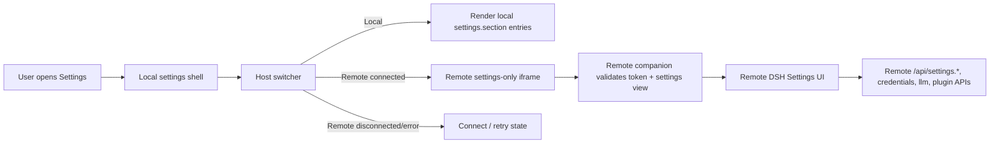

# Remote Settings Host Switcher Design

## Goal

Make Settings look and behave like the official DSH/ChatGPT-style settings surface while allowing the user to configure either the local DSH instance or a selected remote host. The selected host must be obvious at all times, and remote mode must show the remote host's own Settings pages, not local pages wired to remote APIs.

## User experience

Opening Settings shows the same modal design language as the official settings shell: centered rounded panel, left navigation rail, right content column, DSH design tokens, spacing, hover states, selected nav state, and close behavior. The local host is selected by default.

A Host switcher sits at the top of the left rail above the settings sections. It displays the active host label and connection status:

- `Local` for the local instance.
- Remote host labels such as `win-wsl` and `xsn`.
- A status dot and state text for remote hosts when useful: connected, connecting, disconnected, or error.

The switcher opens a compact menu listing Local first, then discovered SSH hosts. Selecting a host changes the Settings context. The selected host remains visible in the left rail while the user edits settings, so the user can always tell which machine will be changed.

Local mode renders the local settings navigation and local settings sections. Remote mode replaces the local content with that host's remote Settings surface. If the remote host is not connected, the content column shows a native-looking empty/error state with a Connect action. Closing Settings resets the selected host to Local to avoid accidental future remote edits.

## Official design-language requirements

The remote-desktop plugin must not introduce a visually separate settings design. It should match the official Settings shell as closely as the extension mechanism allows:

- Use the same modal geometry: left rail, content column, rounded panel, mask, elevation, and close button rhythm.
- Use DSH design tokens for surfaces, labels, borders, hover, selected states, shadows, masks, and scrollbars.
- Use official icon style and sizing where icons are needed.
- Keep typography, row heights, border radii, padding, and menu behavior aligned with the existing `ui-settings-general` Settings shell.
- Avoid broad custom `rd-settings*` styling that drifts from the official surface; custom CSS is limited to the Host switcher and remote iframe container and still uses DSH tokens.
- Remote empty, loading, and error states should look like first-party settings rows/cards, not plugin-specific admin pages.

## Architecture

The local plugin owns a small Settings host shell. It is responsible for the modal, host switcher, local-vs-remote mode, and local fallback states. It does not own remote settings content.

In Local mode, the shell renders local `settings.section` entries exactly as the normal local Settings UI does.

In Remote mode, the shell renders a settings-only iframe for the selected host. The iframe runs the remote DSH client and remote plugins, so the remote host controls which Settings sections exist and how they behave. This satisfies the requirement that “remote has whatever it has.”

The first implementation should use a single active remote iframe. Switching remote hosts replaces the iframe URL. This keeps resource use and lifecycle rules simple. Multi-iframe caching can be added later if preserving per-host in-progress form state becomes important.

## Remote settings-only embed

The local server exposes or reuses a per-host iframe URL and adds a settings-view marker, for example:

```text
?dshRemoteDesktop=1&view=settings#token=<host-token>
```

The remote companion recognizes `view=settings` after validating the parent origin and token. In settings view it:

1. Keeps normal iframe isolation and token checks.
2. Hides the remote app chrome/sidebar/chat area that should not appear inside the local Settings modal.
3. Opens or renders the remote Settings surface.
4. Leaves all remote Settings sections, forms, API calls, credentials calls, model-provider calls, and plugin UI behavior inside the remote app.

Because the remote Settings UI runs inside the remote iframe origin, settings requests naturally target the remote DSH instance. The previous local fetch-patch approach for routing selected settings APIs is not the main design path for this feature.

## Data flow



Host discovery, connection state, connect, disconnect, retry, and iframe URL creation continue to come from the local remote-desktop source store and server routes. The settings shell reads that store to populate the Host switcher and to decide whether a host can be embedded.

## Error and lifecycle behavior

- Default state: Settings opens with Local selected.
- Remote disconnected: show a native settings empty state with host name, status, last error if present, and Connect.
- Remote connecting: show a loading state that clearly names the host.
- Remote connected: show the settings-only iframe.
- Remote iframe load failure: show Retry and Reconnect actions if the host is still known.
- Companion missing or too old for settings view: show an explicit “remote companion does not support settings view” message and ask the user to upgrade the remote companion.
- Host removed or disconnected while selected: return to the host state card for that host, or Local if the host no longer exists.
- Close Settings: reset selected host to Local and unmount the active remote settings iframe.
- Escape and mask click match the official Settings close behavior.

## Accessibility

The Settings modal keeps the official dialog semantics. The Host switcher is a button or combobox-style control with a clear accessible name such as “Settings host, Local” or “Settings host, xsn, connected.” The active host is not communicated only by color. Menu items include host label and state text. Iframe title names the selected host, for example “Settings for xsn.”

## Scope boundaries

In scope:

- ChatGPT-style official Settings shell with left Host switcher.
- Local Settings by default.
- Remote settings-only iframe for connected hosts.
- Clear host identity and connection state in the UI.
- Companion support for settings embed mode.
- Tests proving local/remote mode selection and settings-view routing.

Out of scope for the first implementation:

- Multi-iframe host caching.
- Editing remote settings through local forms.
- Synchronizing settings between hosts.
- Cross-host bulk editing.
- Remote settings search or host search beyond the switcher menu.

## Testing and acceptance

Static/unit checks should prove:

- The Settings shell includes a Host switcher above the nav.
- Settings opens with Local selected.
- Local mode renders local settings sections.
- Remote mode renders an iframe instead of local settings sections.
- Remote iframe URLs include the settings-view marker and host token.
- Disconnected remote hosts render a Connect state rather than an empty iframe.
- The companion detects settings view and applies settings-only chrome behavior.

Acceptance/manual checks should prove:

- The surface visually matches the official Settings design language.
- Opening Settings defaults to Local.
- Selecting `xsn` clearly marks `xsn` as the active settings host.
- A connected remote displays that remote host's own Settings pages.
- A disconnected remote displays a clear connect/retry state.
- Closing and reopening Settings returns to Local.
