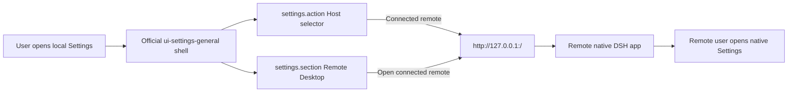

# Remote Settings Native Page Design

## Goal

Let users configure a remote host's settings without embedding or reimplementing the remote Settings UI. The local Settings surface should clearly show which host is selected, but remote configuration happens in that host's native DSH web page opened through the existing forwarded proxy port.

This replaces the previous settings-only iframe direction. The earlier iframe design depended on opening the remote Settings modal from inside the embedded remote app. That is not reliable without changing deepseek-harness because the official Settings shell has local React state and onboarding can legitimately show a first-run dialog before the Settings pages.

## User experience

Opening local Settings shows the local ChatGPT-style Settings modal. It defaults to Local.

A Host switcher can list Local first and then discovered SSH hosts such as `win-wsl` and `xsn`. Selecting Local keeps the current local Settings pages in the modal.

Selecting a remote host does not embed remote settings in the modal. The content area shows a first-party-looking card:

- host label, for example `win-wsl`;
- connection state and last error when present;
- a Connect action when disconnected;
- an Open action when connected, for example `Open win-wsl DSH`;
- helper copy stating that remote settings are configured in the host's native DSH page.

Clicking Open launches a new browser page or tab for that remote host's forwarded native DSH URL. The remote page is not iframe mode and is not settings-only mode. It shows the complete remote DSH app, including its own sidebar, onboarding, plugins, and Settings behavior. The user then opens Settings inside that native page.

## Feasibility findings

The previous settings-only iframe approach is not reliable with only the remote-desktop plugin:

- The official Settings shell in `ui-settings-general` stores open state and active section state inside React components, not in a URL route or public command.
- `settings.onboarding` is an official part of the Settings shell. On a fresh or blank remote host it can show a first-run dialog such as API-key onboarding before the Settings pages.
- The companion cannot safely bypass that by clicking DOM nodes. It depends on labels, structure, timing, and modal order.
- A companion replacement shell could avoid onboarding in iframe mode, but it would need to disable and replace the remote profile's official `ui-settings-general` registration because slot child declarations are exclusive. That is too invasive for this requirement.
- Deep imports or runtime loading of the official Settings shell are not a stable option because the component and its child-slot render authority are not public extension APIs.

Opening the remote native DSH page through the existing proxy avoids these constraints. It delegates all remote Settings behavior back to the remote app that owns it.

## Architecture

The local plugin keeps the remote source store and SSH/proxy lifecycle it already owns.

Each connected remote source currently exposes an `iframeUrl` like:

```text
http://127.0.0.1:<proxyPort>/?dshRemoteDesktop=1#token=<token>
```

For native-page settings, the local client derives a `nativeUrl` from that URL:

```text
http://127.0.0.1:<proxyPort>/
```

The derived URL removes the `dshRemoteDesktop` query marker and token hash. The proxy server remains the same per-host loopback proxy; only the browser entry URL changes.

The local Settings modal remains the official `ui-settings-general` shell. Remote Desktop contributes a Host selector through `settings.action` and a `Remote Desktop` page through `settings.section`. Selecting a connected remote host, or clicking Open in the Remote Desktop page, opens the remote DSH page as a separate top-level browsing context with `window.open(nativeUrl, '_blank', 'noopener,noreferrer')` or an equivalent anchor.

## Data flow



## Error and lifecycle behavior

- Local is selected by default when Settings opens.
- Disconnected remote hosts show a Connect action and the latest connection error, if any.
- Connected remote hosts show an Open native DSH action.
- If `window.open` returns `null`, show a short message that the browser blocked the popup and expose the native URL as a normal link the user can click.
- Closing local Settings resets the selected host to Local.
- The native remote page keeps using its forwarded proxy while the source remains connected. If the user disconnects the host in the local page, the native page may stop working; that is expected and should be mentioned in helper copy.

## Security and isolation

The native URL must not include the iframe token. The token is only for companion-controlled iframe mode.

The native page uses the remote proxy origin. It is a full remote DSH web page and should not be embedded in the local page. Remote Settings reads and writes go directly to the remote DSH instance through that proxy origin.

Use `noopener` when opening the page so the remote page cannot control the opener.

## Scope

In scope:

- Replace remote settings iframe behavior with official Settings slot contributions.
- Derive and open the native remote DSH URL for connected hosts.
- Preserve the official local Settings shell and local Settings pages.
- Keep host identity clear through the `settings.action` Host selector and Remote Desktop page.
- Add tests/static checks proving native URL derivation, absence of settings-only iframe behavior, and no token in the native settings URL.
- Update acceptance/manual checklist to verify a remote native page opens.

Out of scope:

- Embedding remote Settings inside the local modal.
- Reimplementing remote Settings from settings APIs.
- Replacing the local or remote official Settings shell.
- Forcing the remote native page to open directly on its Settings modal.
- Suppressing remote onboarding. If remote onboarding appears, it is the remote app's native behavior.

## Testing and acceptance

Static/unit checks should prove:

- The local client no longer uses `view=settings` or settings-only iframe behavior.
- The local plugin keeps `ui-settings-general` enabled and registers `settings.action` for the Host selector.
- Connected remote host mode derives a native URL from `iframeUrl` by clearing search and hash.
- The native Open action uses `noopener` and does not include `token` or `dshRemoteDesktop=1`.
- Disconnected remote host mode shows Connect rather than Open.

Manual/acceptance checks should prove:

- Settings opens with Local selected.
- Selecting `win-wsl` clearly shows `win-wsl` as the remote settings target.
- Clicking Open launches a new page whose URL is the forwarded remote origin without `dshRemoteDesktop=1` or token hash.
- The new page shows the complete remote native DSH app.
- Opening Settings inside that new page follows the remote host's normal native behavior.
