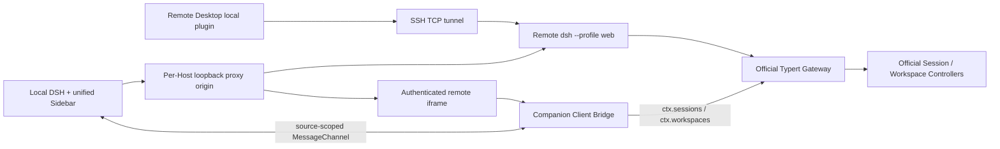

# 基于官方 Gateway 的 Remote Desktop Companion Client Bridge 设计

## 状态

Implemented。第一阶段使用官方 Client Controller 的 event-driven replacement baseline；未依赖未公开的原始增量 frame。

本设计基于 DSH 仓库 `/Users/i060912/SAPDevelop/dsh` 的 commit：

```text
4e84901e6471b79ec0338099867ebb4606d12bb5
```

## 摘要

`dsh-remote-desktop` 继续在每台远端机器上运行完整的 `dsh --profile web`。远端 DSH Web 本身就是当前最接近“DSH App Server”的运行形态：它包含 Host Runtime、Typert API Gateway、Session Controller、Workspace Controller、HTTP/WebSocket transport 和 Web UI。

新版 DSH 已原生提供 Session/Workspace 的 typed RPC、baseline/delta stream、重连、取消及浏览器 token-to-cookie 认证。因此，Remote Desktop 不再维护一套平行的 Companion Host 数据 API。

最终职责划分为：

- **远端 DSH Web + 官方 Gateway/Controller**：唯一的 Session/Workspace 数据和业务操作来源；
- **Companion Client**：只处理嵌入式 iframe UI、父子窗口认证、状态转发和 `open-session` 等 UI 控制；
- **本地 Remote Desktop plugin**：负责 SSH 生命周期、每 Host 代理、多个远端 Host 的统一投影和本地 UI。

Companion 包仍安装在远端 Web profile 中，但删除其自定义 Host 业务接口 `/snapshot` 和 `/rpc`。Companion 不再是远端守护进程，也不再复制官方 Controller；它只是运行在远端 DSH iframe 内的一个轻量 Client Bridge。

## 目标

- 以官方 Session/Workspace Controller 作为远端状态和 mutation 的唯一实现。
- 删除 Companion Host 自定义 snapshot polling 和 RPC 转发层。
- 保留统一的本地/多远端 Workspace Sidebar。
- 保留完整远端 DSH UI、远端插件环境和会话页面。
- 保留 iframe 隔离及精确的 origin、window source、source token 校验。
- 利用官方 Gateway 已提供的 baseline/delta、重连、取消和错误语义。
- 将 Companion 缩减为小而稳定的嵌入式 UI 适配层。
- 为未来 DSH 支持多 Host Client Context 后完全删除 Companion 留出迁移路径。

## 非目标

- 不把 `dsh --profile sdk` 作为远端常驻网络服务。SDK profile 是由调用方启动并持有的 stdio JSON-RPC 子进程，API 面也不等同于 Web Controller。
- 不在本阶段让本地主页面直接创建多个底层 DSH Gateway/Controller Context。
- 不把远端文件系统和 subprocess 映射成本地实现；远端仍运行完整 DSH。
- 不删除远端 iframe，也不把远端插件重新挂载到本地 React tree。
- 不改变统一 Sidebar 的产品行为。
- 不新增未经官方认证保护的 Host HTTP API。

## 背景与当前问题

当前连接模型包含四层：

1. 远端安装 `dsh-remote-desktop-companion`；
2. 远端启动 `dsh --profile web`；
3. 本地创建 SSH tunnel 和每 Host HTTP/WebSocket proxy；
4. Companion 提供 Host API 和 iframe Client Bridge。

历史 Companion Host API 包括：

```text
GET  /remote-desktop-companion/api/health
GET  /remote-desktop-companion/api/snapshot
POST /remote-desktop-companion/api/rpc
```

本地再通过以下兼容路由转发：

```text
GET /remote-desktop/api/snapshot?id=<host>
*   /remote-desktop/api/host-api?id=<host>&path=<method>
```

其中 `/snapshot` 和 `/rpc` 手动读取或调用 `sessionController`、`workspaceController` 与 `workspaceRegistry`。这会产生以下问题：

- 重复官方 Gateway/Controller 的协议、错误映射和方法 allowlist；
- 容易绕过或偏离 DSH 官方浏览器认证边界；
- polling 会周期性传输所有 Session/Workspace；
- 新增官方 Controller 能力时，Companion RPC 需要同步扩展；
- cancellation、重连及 baseline/delta 语义被自定义 HTTP 层削弱；
- Companion 同时承担 Host API 和嵌入式 UI 两种不相关职责。

新版 DSH 中，`ctx.sessions` 和 `ctx.workspaces` 已是官方 Client Controller facade。它们背后通过 Typert Gateway 使用 reconnecting Remote stream：

- Session Controller 使用 Host-wide control baseline/delta stream；
- Workspace Controller 使用 baseline，以及 `upsert`、`remove`、`order`、`archived` increment；
- mutation 通过 generated Remote namespace 调用 Host；
- browser launch token 在远端 origin 上换取 authority-bound、HttpOnly、SameSite cookie。

因此，远端 iframe 已经拥有一条完整、认证且可重连的官方连接。Remote Desktop 应复用它，而不是再创建 Companion Host API。

## 核心决策

### 1. 远端运行完整 DSH Web

远端服务使用：

```sh
dsh --profile web --host 127.0.0.1 --port <remote-port> --no-open
```

它只监听远端 loopback，通过 SSH tunnel 暴露给本机。实际参数必须以当前 DSH CLI 支持情况为准；若 `--port 0` 能稳定输出最终 authenticated URL，后续应改用动态端口。

`--profile web` 是此场景的“App Server”。`--profile sdk` 不适合，因为它是 stdio 子进程协议，不能承载现有远端 Web UI 和插件。

### 2. 删除 Companion Host 业务层

删除：

- `/remote-desktop-companion/api/snapshot`；
- `/remote-desktop-companion/api/rpc`；
- `RPC_METHODS` 和手工 Controller method mapping；
- `DSH_REMOTE_DESKTOP_COMPANION_TOKEN` Host API token；
- 本地 `/remote-desktop/api/snapshot` compatibility route；
- 本地 `/remote-desktop/api/host-api` compatibility route；
- 对这些 route 的 acceptance-only 依赖。

`/health` 仅可作为迁移期的“Companion package 已加载”探针，不得携带业务数据。最终连接 readiness 应由官方 DSH readiness 加 iframe `ready` 消息共同确认，届时 `/health` 也应删除。

### 3. 保留 Companion Client

Companion Client 只执行以下职责：

1. 在明确的 iframe mode 下安装窄范围 CSS，隐藏远端 DSH 自身 Sidebar；
2. 使用 `ctx.sessions` 和 `ctx.workspaces` 读取官方 Client Controller 状态；
3. 把统一 Sidebar 所需状态转发给 parent；
4. 通过官方 Client Controller 执行 parent 请求的 UI 操作；
5. 处理父子 iframe 握手、取消、释放和错误返回。

它不得：

- 注册 Session/Workspace Host route；
- 直接读取远端持久化文件；
- 直接依赖 Host `sessionController`、`workspaceController` 或 `workspaceRegistry`；
- 实现与官方 Gateway 平行的网络认证或重连机制。

### 4. 使用 iframe 内已有的官方连接

短期内不在本地主页面直接创建每 Host Gateway。每个远端 iframe 自身就是独立的 DSH Client Context，并已连接对应远端 Host。Companion 只把这个 Context 中的安全、最小数据投影桥接给 parent。

这是保留 Companion 的根本原因：当前 DSH Client 默认围绕一个 Host Context 组合。Remote Desktop 同时聚合多个 Host，而远端 iframe 天然提供了每 Host 隔离的 Context、认证 cookie、插件和 UI。

## 目标架构



重要边界：

- SSH/Proxy 只负责 transport；
- 官方 Gateway 负责远端业务协议；
- MessageChannel 只负责 iframe 与聚合 UI 之间的桥接；
- 本地 Sidebar 不直接假装自己属于任一远端 Host。

## 连接生命周期

### 远端进程发现与启动

每个 Host 的连接按以下顺序执行：

1. 用户显式 Connect，或该 Host 配置了 `autoConnect`；
2. 通过 SSH 检查远端 `dsh` 是否存在；
3. 检查隔离的远端 Web profile 是否包含 Companion package；
4. 若允许 setup，安装/更新 Companion package；
5. 复用由 Remote Desktop 管理的健康 DSH Web，或启动新进程；
6. 从启动输出读取 authenticated URL/token；
7. 建立原始 SSH TCP tunnel；
8. 建立每 Host 独立的本地 proxy origin；
9. iframe 首次访问 authenticated URL，将 token 换成该 proxy authority 对应的 cookie；
10. iframe 重定向到无 token URL并加载 DSH Client；
11. Companion 完成 MessageChannel 握手并发送 `ready`；
12. Host 进入 UI-ready 状态并发布首个 Controller baseline。

不能仅凭端口已监听就杀掉或接管进程。只允许通过自己记录的 PID/lease 管理由插件启动的进程。

### 状态机

```text
disconnected
  -> preparing
  -> tunnel-ready
  -> authenticating
  -> bridge-ready
  -> connected
```

失败状态至少区分：

- SSH 不可达；
- 远端没有 DSH；
- Companion 未安装或版本不兼容；
- DSH 启动失败；
- authenticated URL 未取得；
- tunnel/proxy 失败；
- iframe 认证失败；
- bridge handshake 超时；
- 官方 Controller stream 暂时重连或终止。

Disconnect 必须取消 setup、关闭 tunnel/proxy/WebSocket、关闭 MessagePort、清理 pending request，并让远端 iframe 从统一投影中消失。是否停止远端 DSH 由独立的进程 ownership 策略决定，不与普通 Disconnect 隐式绑定。

## 认证与安全模型

### 网络面

- 远端 DSH 仅监听 `127.0.0.1`；
- SSH tunnel 仅绑定本地 loopback；
- 每 Host 使用不同 proxy origin/port；
- HTTP 和 WebSocket 都只做透明转发，不注入绕过 Gateway 的业务请求；
- authenticated URL 中的 DSH launch token 只用于远端 origin 首次登录；
- token 换取 cookie 后必须从地址栏和后续 iframe URL 中移除；
- 不把一个 Host 的 cookie、launch token 或 source token 复制给另一个 Host。

### iframe bridge 面

初始 `window.postMessage` 握手必须同时验证：

- `event.origin === expectedParentOrigin`；
- `event.source === window.parent`；
- message token 等于 iframe URL hash 中的 per-source token；
- parent 端也验证 `event.source === expectedIframe.contentWindow`；
- parent 端发送到精确 proxy origin，禁止 `*`。

握手完成后转移一个独占 `MessagePort`。业务消息只走该 port。source token 继续出现在每个 frame 中作为防串线校验，但它不是 DSH Gateway 凭证。

Companion CSS 继续遵守窄范围约束，不允许 broad `[class*=frame]` 或影响远端插件内容的全局 rewrite。

## Bridge 协议

协议应显式版本化：

```ts
interface BridgeHello {
  type: 'dsh-remote-desktop/connect'
  protocolVersion: 1
  sourceToken: string
}

interface BridgeReady {
  type: 'dsh-remote-desktop/ready'
  protocolVersion: 1
  sourceToken: string
  capabilities: string[]
}
```

### 状态流

首个可用状态发送 baseline：

```ts
interface StateBaseline {
  type: 'dsh-remote-desktop/state-baseline'
  sourceToken: string
  generation: string
  revision: number
  sessions: SessionListProjection
  workspaces: WorkspaceProjection
}
```

后续优先发送 delta：

```ts
interface StateDelta {
  type: 'dsh-remote-desktop/state-delta'
  sourceToken: string
  generation: string
  revision: number
  domain: 'sessions' | 'workspaces'
  change: unknown
}
```

规则：

- 新 MessagePort、官方 stream 重连或 revision gap 后必须重新发送 baseline；
- parent 只接受当前 generation 且 revision 连续的 delta；
- gap、乱序或未知 change 触发 `state-resync`；
- 同一 microtask 内的 Controller 更新应合并；
- 只发送统一 Sidebar 所需字段，不发送完整会话 history；
- 若当前公开 `ctx.sessions.list` / `ctx.workspaces.list` 只能提供聚合 snapshot，第一阶段允许发送 event-driven replacement baseline，但禁止恢复定时 polling；
- 第二阶段再从官方 Controller frame 或稳定的增量 seam 映射真正 delta，不能依赖私有未导出的内部对象。

最后一条避免为了“delta”再次 fork 官方 Controller 内部实现。正确性优先于微小 payload 优化。

### Command 流

```ts
interface BridgeRequest {
  type: 'dsh-remote-desktop/request'
  sourceToken: string
  requestId: string
  method: BridgeMethod
  payload: unknown
}

interface BridgeResult {
  type: 'dsh-remote-desktop/result'
  sourceToken: string
  requestId: string
  ok: boolean
  value?: unknown
  error?: { code: string; message: string }
}
```

Bridge method 只表达统一 UI 所需的高层动作，例如：

- `session/open`；
- `session/create`；
- `session/search`；
- `session/rename`；
- `session/fork`；
- `workspace/create`；
- `workspace/rename`；
- `workspace/delete`；
- `workspace/insertBefore`；
- `workspace/archiveSession`；
- `workspace/insertSessionBefore`。

这些不是新的 Host RPC。Companion 在已认证的 iframe Client Context 中调用官方 `ctx.sessions` / `ctx.workspaces` facade。方法表是 parent/iframe UI capability allowlist，不复制官方 wire protocol。

每个 request 必须有：

- correlation id；
- timeout；
- teardown cancellation；
- structured error；
- `session/open` latest-wins cancellation；
- 重复 result 忽略；
- 未声明 capability 的调用拒绝。

## 多 Host 聚合

本地 Remote Store 为每个 Host 保存：

```ts
interface RemoteSourceState {
  sourceId: string
  connectionState: string
  bridgeState: string
  generation?: string
  revision?: number
  sessions?: SessionListProjection
  workspaces?: WorkspaceProjection
  error?: string
}
```

进入统一 Sidebar 前，所有远端 id 继续 source-qualify：

```text
remote::<sourceId>::<rawId>
```

规则：

- 一个 Host 的 delta 只能修改自己的 source partition；
- mutation 必须按 row owner 路由到对应 MessagePort；
- 不允许把 remote id 传给本地 `ctx.sessions` / `ctx.workspaces`；
- 跨 Host reorder 和 drag 必须拒绝；
- 一个 Host 重连不清空其他 Host；
- iframe 暂时不可见时仍可保持连接和 Controller stream，除非资源策略明确将其挂起。

## Server API 调整

迁移完成后，本地 server plugin 只保留主机和 transport 管理接口：

| Route | 结论 |
| --- | --- |
| `GET /remote-desktop/api/sources` | 保留 |
| `GET /remote-desktop/api/hosts` | 保留或与 sources 合并 |
| `POST /remote-desktop/api/sources` | 保留 |
| `POST /remote-desktop/api/connect` | 保留 |
| `POST /remote-desktop/api/disconnect` | 保留 |
| `POST /remote-desktop/api/delete` | 保留 |
| `GET /remote-desktop/api/events` | 保留，只发布 Host lifecycle invalidation |
| `GET /remote-desktop/api/browse` | 暂时保留；它是 SSH 文件浏览能力，不是 DSH Controller 替代 |
| `GET /remote-desktop/api/snapshot` | 删除 |
| `/remote-desktop/api/host-api` | 删除 |

所有保留的本地 management route 继续经过本地 DSH `ctx.connection.requestRejection()`。

## 为什么现在不完全删除 Companion

完全删除 Companion 有两个可行前提之一：

1. 放弃统一 Sidebar，用户直接使用每个远端 DSH 的完整页面；或
2. DSH 官方支持在同一个本地 Client Runtime 中创建多个独立 Gateway + Session Controller + Workspace Controller Context，并提供稳定的多 Host UI seam。

当前产品要求同时展示多个 Host，并在本地主页面点击远端 Session 后显示完整远端 UI。iframe 是隔离不同 Host Client Context 和远端插件最可靠的方式，而 Companion Client 是 parent 与这些 iframe Context 之间最小的适配层。

因此当前选择不是“继续维护一套远端 API”，而是“保留一个薄的 iframe UI bridge”。

## 迁移计划

### Phase 0：冻结兼容层

- 不再给 Companion Host `/rpc` 增加新方法；
- 新 UI 功能只通过 iframe Client Bridge 实现；
- 为当前 compatibility route 增加 deprecation 标记和调用观测；
- acceptance 测试区分正常 UI 路径与 compatibility 路径。

### Phase 1：官方 Controller 驱动的 Client Bridge

- 使用 `ctx.sessions.list`、`ctx.workspaces.list` 作为唯一状态来源；
- 订阅变更并通过 MessageChannel event-driven 发布；
- 所有 Sidebar mutation 改走官方 Client Controller facade；
- 完成协议版本、capability、generation/revision 和 resync；
- 删除客户端的 snapshot polling 与 Host API fallback；
- 保留 compatibility route 仅用于测试迁移，不用于生产 UI。

### Phase 2：删除 Companion Host 业务 API

- 删除 Companion `/snapshot`、`/rpc`、Host Controller injections 和 bridge token；
- 删除本地 `/snapshot`、`/host-api` 及 proxy 实现；
- acceptance fixtures 改为通过浏览器 bridge 或官方 Gateway 验证；
- Companion server entry 最多只暂留 `/health`。

### Phase 3：现代化远端进程与认证生命周期

- 优先支持动态远端端口；
- 解析并保存本次启动产生的 authenticated URL，而不是构造裸 URL；
- 使用 single-flight connect；
- 完整取消 setup/tunnel/proxy；
- 使用 ownership record/PID lease 管理由插件启动的进程；
- 明确 idle cleanup 与 reconnect backoff；
- iframe `ready` 取代 Companion `/health` 后删除 health route。

### Phase 4：评估无 Companion 架构

当 DSH 上游提供稳定的 multi-Host Client Context 后，验证：

- 本地是否能直接创建每 Host 官方 Gateway client；
- Session/Workspace Controller 是否能按 Context 实例隔离；
- 远端完整 UI/插件是否仍需 iframe；
- 若 iframe 仍需保留，是否能通过官方 embed API 取代 Companion CSS 和 bridge。

只有这些条件满足后才删除 Companion package。

## 测试与验收

### 静态与单元测试

- `npm run check`
- Bridge origin/source/token 拒绝测试；
- protocol version/capability 拒绝测试；
- baseline、delta、revision gap、resync 测试；
- MessagePort teardown 和 pending request cancellation 测试；
- `session/open` latest-wins 测试；
- 不同 Host token、origin、state 不串线；
- remote mutation 不落到 local Controller；
- `/snapshot`、`/rpc`、`/host-api` 删除后的 404/无注册验证；
- connect/disconnect single-flight 和 setup cancellation 测试。

### Container acceptance

优先运行：

```sh
npm run acceptance:container:p0
npm run acceptance:container:p1
```

必须证明：

- 两个远端 Host 同时显示于统一 Sidebar；
- Session/Workspace 的新增、改名、归档、排序通过官方 Controller 生效；
- 远端 DSH 重启后官方 stream 自动恢复并重新 baseline；
- iframe 重新认证后 bridge 恢复；
- 断开一个 Host 不影响本地和另一个 Host；
- 没有周期性的 `/snapshot` 请求；
- 没有 `/remote-desktop-companion/api/rpc` 请求；
- 远端插件和主会话 UI 在 iframe 中正常工作；
- Companion CSS 只隐藏远端 Sidebar。

涉及 iframe 布局和 Sidebar 时，额外执行 `scripts/acceptance/check-ui-manual.md`。

## 风险与缓解

### Client snapshot 不是原始 delta

公开 Client facade 可能只暴露 `getSnapshot()/subscribe()`，而不是原始 Controller frame。第一阶段允许在订阅触发后发送完整的精简 replacement snapshot。它仍然是 event-driven，已消除 polling 和 Host API；真正 delta 只在上游提供稳定 seam 后实现。

### iframe 未显示时无法取得数据

统一 Sidebar 依赖每个已连接 Host 的 iframe Client Context。连接后应挂载隐藏 iframe 并完成认证/bridge，而不是等用户首次点击 Session 才创建。资源控制应采用 idle policy，而不是破坏状态正确性。

### authenticated URL 泄露

launch token 不得写入 sources API、普通日志、DOM attribute、localStorage 或 parent bridge frame。它只进入对应 proxy-origin iframe 的首次导航，并由 DSH 官方流程换取 cookie。

### 上游 UI DOM 变化

隐藏 Sidebar 仍依赖窄范围 CSS，是 Companion 最脆弱的部分。每次更新 DSH baseline 都要执行 manual layout checklist。长期应推动官方 embedded mode 或 sidebar visibility seam。

### Bridge 再次演变为 RPC 平台

Bridge method 必须限定为本地统一 UI 的动作，不暴露任意 Gateway method/path，不传递凭证，也不允许插件外部调用。新增 method 需要 capability、测试和明确 UI consumer。

## 成功标准

设计完成后的系统应满足：

- 远端 Session/Workspace 的 wire authority 只有官方 DSH Gateway/Controller；
- Companion Host 不再提供 snapshot 或 mutation API；
- 生产 UI 没有 snapshot polling；
- 多 Host 统一 Sidebar 和完整远端 iframe UI保持不变；
- 所有远端 mutation 通过对应 iframe 内的官方 Client Controller；
- Host 之间的 origin、cookie、token、MessagePort 和状态严格隔离；
- DSH Gateway 重连与 baseline 恢复不需要 Remote Desktop 自己复制一套协议；
- Companion 的剩余代码可清晰描述为“embedded UI bridge”，而不是“远端服务端”。
